# 3D Printed Astro Pi Flight Case


The Astro Pi flight case is one of the most desired cases in the history of the Raspberry Pi. With this resource you will learn how to 3D print your own case and install the Astro Pi hardware inside it. You'll then have your very own Astro Pi flight unit identical in almost every way to the ones on the International Space Station right now.

If you're participating in an Astro Pi competition this is a great way to prototype and ergonomically test your code in the same way as it would be used by the crew of the ISS.

## Checklist


If you're planning to build a full Astro Pi flight unit, check that you have all the parts required before you start:

Part|Quantity|Info|Purpose
---|---|---|---
Raspberry Pi|1|B+ or 2B|Main computer
Camera Module|1|Normal or Pi NoIR|Main camera
Sense HAT|1||Main sensors
2x20 pin PCB header|1|15 mm long pins, 2.54 mm pitch spacing|Goes onto the GPIO pins to hold the Sense HAT at the correct height
M2 cross head screw|4|4 mm|Fixes camera module into base
M2.5 male to female stand off|4|11 mm|Holds the Sense HAT at the correct height †
M2.5 male to female stand off|4|8 mm|Holds the Sense HAT at the correct height †
M2.5 nut or washer|4|1.6 mm depth|Holds the Sense HAT at the correct height †
M2.5 cross head screw|4|6 mm|Fixes the top of the Sense HAT to the stand offs below
M4 bolt|4|30 mm|Used in the corner bolt enclosures to hold the case together
M4 hex nut|4||Used in the corner bolt enclosures to hold the case together
Tactile push buttons|6|10 mm threaded bushing |Function buttons
Laptop trackpoint cap|1|Flight units use Lenovo part 73P2698|Goes on the Sense HAT joystick

† = You could achieve this height in other ways if you wish. For example with 20.6 mm stand offs. Perhaps even 3D print your own?


If you want to buy the exact buttons used in the Astro Pi flight unit the details are below, at about £9 each they're expensive because they're designed to survive an enormous number of clicks before wearing out (necessary for a 7 year space mission). So you might want to consider looking for a cheaper one that would also fit. A button with a threaded bushing of 10 mm diameter will fit the holes in the lid.

- Manufacturer: APEM
- Manufacturer Part No: 104350003

You're also going to need the following tools:

- Small cross head screwdriver
- Small pair of pliers
- Craft knife or scalpel
- Sand paper
- Epoxy adhesive
- Kapton tape (or similar)
- Soldering iron
- Solder

## Get access to a 3D printer

First and foremost you'll need access to a 3D printer to do this. Many schools now have their own but if your school doesn't then you may be able to find one at your local [hackspace](http://www.hackspace.org.uk/wiki/Main_Page). You can also find local 3D printing services through the [3D Hubs](https://www.3dhubs.com/) website.

## Get the 3D files

The 3D files are in [STL](https://en.wikipedia.org/wiki/STL_%28file_format%29) format which is widely used in 3D printing all over the world. The software for your 3D printer will have no problem loading them.

- [Part 1](https://github.com/raspberrypilearning/3d-printed-astro-pi-flight-case/raw/master/STL/Astro_Pi_Enclosure_3D_PRINT_SECTION_1%20V1.STL) (heat sink)
- [Part 2](https://github.com/raspberrypilearning/3d-printed-astro-pi-flight-case/raw/master/STL/Astro_Pi_Enclosure_3D_PRINT_SECTION_2%20V1.STL) (base)
- [Part 3](https://github.com/raspberrypilearning/3d-printed-astro-pi-flight-case/raw/master/STL/Astro_Pi_Enclosure_3D_PRINT_SECTION_3%20V1.STL) (middle)
- [Part 4](https://github.com/raspberrypilearning/3d-printed-astro-pi-flight-case/raw/master/STL/Astro_Pi_Enclosure_3D_PRINT_SECTION_4%20V1.STL) (lid)

The 3D files do not exactly match those used to make the aluminium flight cases on the space station. They have been modified to make them 3D printer compatible so that most people who attempt this will achieve success without difficulty.

Most notably the case has been sliced into four parts. This has been done to minimise the amount of rafting and scaffolding that needs to be printed along with the model and also reduces the time you spend cleaning up the final prints.

## Safety first

**It is important that you observe the correct safety procedures specified in the safety data sheet for your specific 3D printer.**

Potential hazards include:

- Hot surfaces and thermoplastics (print head block and lamp)
- Ultraviolet radiation (lamp)
- High voltage (lamp connector, electric outlet)
- Moving parts (printing assembly)

## Print each part

Because there are so many different types of 3D printer we cannot possibly provide instructions for them all, so we can only provide rough guidance here and you'll need to figure out the rest on your own.

To get a nice finish we recommend you print on a high detail setting, usually this is a number specified in [microns](https://en.wikipedia.org/wiki/Micrometre) in the 3D printer software. The lower this number is the more precise the model will come out. Please also be aware that precise prints take longer and, for these models, each piece can take up to **four** hours to complete. Make sure you have enough filament.

The STL files should have the models like this by default but please make sure you print in the orientations shown below in order to minimise scaffolding and rafting. 

### Heat Sink


### Base

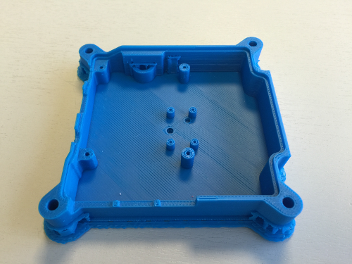

### Middle


### Lid


## Remove the scaffolding

In order to keep the model structurally sound while printing your 3D printer will create what's called scaffolding and rafting to prevent the hot thermoplastics from bending or sagging. Leave the print to cool right down to room temperature before you touch it.

### Heat Sink

You should be able to remove the scaffolding on the heatsink using just yout hands, this part may bend slightly so don't be too rough while doing this.


You may choose to not print this part because it's not essential to the rest of the case and because it's made of plastic it *will not* work as a heatsink. We've included it anyway so that you can achieve the iconic look and feel of the Astro Pi flight case though.

### Base

The base scaffolding should come away easily, as with the heatsink, however you'll also need to remove some material that was used to support the corner bolt enclosures and around the aperture for the Micro SD card. A small pair of pliers is ideal for this.

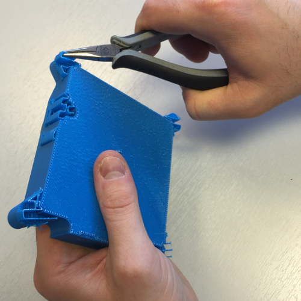

### Middle

Again the scaffolding should come away easily and there will be some material around the corner bolt enclosures that you'll need to remove.

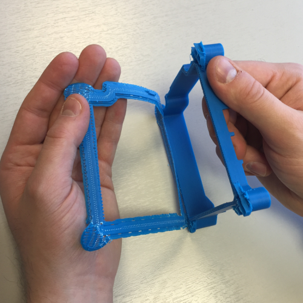

### Lid

The bottom layer of scaffolding on the lid should come away easily again.


However there are a few sunken holes on the underside that must also be cleared of material. These are there to prevent the lid from impacting the Raspberry Pi hardware when installed into the case. You'll need a scalpel or craft knife to dig into it.

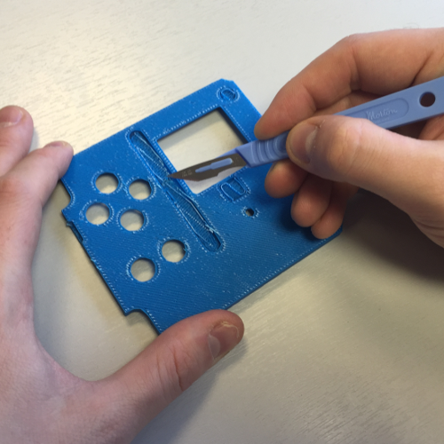

Once you've managed to lift some of it use a pair of small pliers to remove the rest of the material. The areas marked with a red star below need the same treatment.

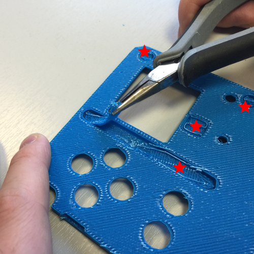

When you're done it should look like this:


## Do a fit check

Before proceeding put all the pieces together to check that they fit correctly. The lipped edge between the base and middle pieces is of most concern to you here. The heat sink and lid just need to line up.


Don't worry about any imperfections or residue from the scaffolding at this stage, you can tidy this up later with sand paper.

## Epoxy adhesive

Use some high performance epoxy adhesive to glue the heat sink to the base, and then the lid to the middle. You may wish to leave the this step until after you've installed the hardware in the base. It may help mitigate any alignment issues later on.


## Fold the camera ribbon

Getting the camera into the case can be a little tricky but here is how we did it for the flight units. Firstly disconnect the ribbon cable from the camera, the two tabs lift up on either side to release the cable in the same way as they do on the Raspberry Pi itself. Then fold the ribbon similar to how it's shown below. These folds allow the camera cable to come up the side of the Raspberry Pi with enough flex to insert into the CSI camera port (see further down).

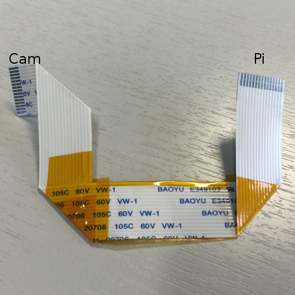

You don't need to get this perfect for it to work, but try to get it as close as possible. The kapton tape is also optional, any kind of tape will work fine if you want to prevent the ribbon from unfurling.

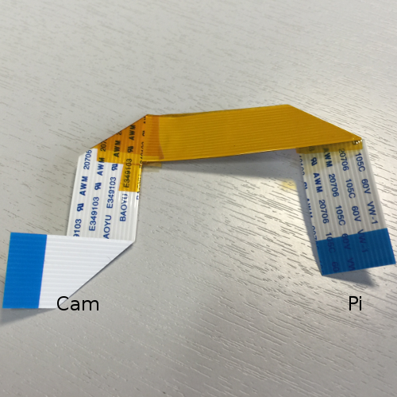

## Install the camera

Reconnect the `Cam` end of the ribbon cable to the camera module. Make sure that the tin connectors are facing the front and the blue tab is on the back.

Before proceeding line up the camera module with the support pillar pilot holes and have a look through the aperture in the base to check the alignment of the lens. The lens block of the camera module is actually stuck in position with adhesive at the factory and therefore its alignment can vary slightly from camera to camera. If you find you've got an alignment issue you should be able to manipulate the lens block between finger and thumb before you install it into the case permanently.

When you're happy the camera module should be installed into the case as shown below. With light finger pressure the M2 cross head screws will cut their own thread in the support pillar pilot holes. After just a few turns you'll probably need a small screw driver to continue.

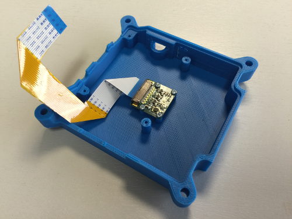

Stop turning as soon as the head of the screw touches the camera module, if you tighten the screw too much it can cause the support pillar to split horizontally along the grain of the print. Also try to avoid removing and re-threading the screws as this will cut a brand new thread and, if done repeatedly, will erode the inside of the support pillar so that the screws will not hold.

## Install the Raspberry Pi

Firstly ensure there's no residual scaffolding material around the SD card slot or LED holes that might prevent the Raspberry Pi from lining up with the mounting pillars. Once you're happy line up the Raspberry Pi and do a fit check. Verify that it doesn't impact the Camera Module below it. Don't insert the camera ribbon cable just yet as this will make the next job awkward.

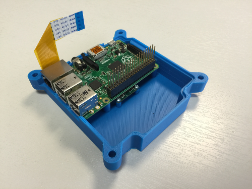

Next take the M2.5 - 11 mm stand offs and with some light finger pressure they will cut their own thread in the support pillar pilot holes. After a few turns you'll need to use a small pair of pliers to continue turning them. It's possible to get these to go in at a slight angle which can lead to alignment issues of the Sense HAT later on, so do your best to make sure these go into the support pillars as straight as possible. Be careful while you do this and, again, stop turning as soon as the stand off touches the Raspberry Pi to avoid spliting the pillars horizontally along the grain of the print.


Now you can insert the camera ribbon cable into the CSI port of the Raspberry Pi. Try to make sure the tin connectors are all level to ensure a good connection.

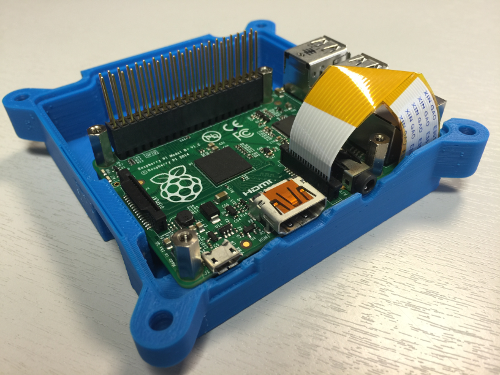

## Install the Sense HAT

This is where we're going to deviate from what is inside the Astro Pi flight unit. The flight units have another circuit board in between the Raspberry Pi and Sense HAT which holds a real time clock, oscillator crystal and backup battery. This RTC board also has some pins that the six push buttons connect to. Unfortunately this is not available to the public.

Our goal was to keep the 3D printed flight case as *faithful* to the original as possible so the decision was taken to *not* alter it to accommodate the absence of this board. It may be possible for us to release the Gerber files for it in the future so that people can make their own.

So we're going to use a hex nut or washer of the same depth as the RTC board to compensate for its absence. The RTC board is 1.6 mm thick so we need a nut or washer of the same thickness. There are many ways you could achieve this, for example with two washers of 0.8 mm thickness. You could 3D print one?

Take an 8 mm M2.5 stand off and put the hex nut or washer onto its thread before screwing it into the hole of the 11 mm stand off as shown below. Do the same for the remaining three stand offs.


The Sense HAT can then be inserted onto the GPIO pins, note that the long pins of the PCB header should not protrude through the top of the Sense HAT. If they do then the height is not correct.


Finally use the M2.5 cross head screws to secure the Sense HAT to the stand offs below.

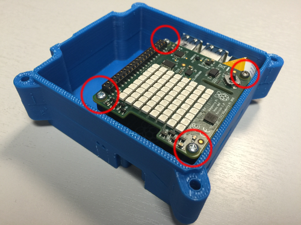

## Install the push buttons

The guidance here assumes you're using the APEM buttons that we used in the flight unit. These have a thread which goes through the lid from below along with a friction washer, to stop it rotating, and then a collar to secure the button from the top. The red line below indicates where the lid should be.

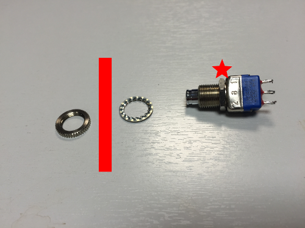

Insert the thread along with the friction washer from the underside of the lid.


Place the collar over the threading and tighten securely.

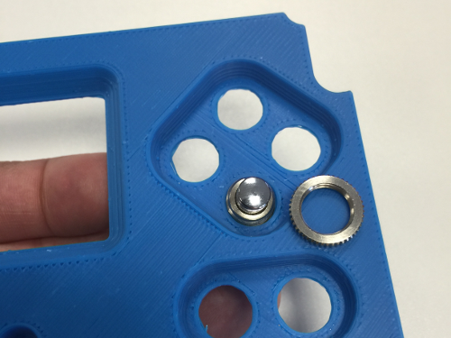

When you're done it should look like this. Do the same for the remaining buttons.

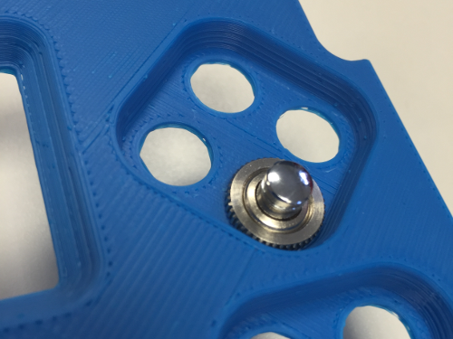

## Wire up the buttons

Without the RTC board in the middle you won't have a convenient way to wire the buttons to the GPIO pins of the Raspberry Pi. Because there are so many ways this can be solved you should decide yourself. Possible ways include making your own middle board, soldering directly onto the vertical pins of the PCB header or soldering onto the base of the GPIO pins on the underside of the Raspberry Pi.

To match the flight unit you should wire the buttons to the last six GPIO pins at the bottom of the header.


Note the orientation of the pin diagram is with the Ethernet and USB ports facing downwards, and the row of pins on the right hand side of the Pi. They need to be wired in a **pull up** configuration in order to match the flight unit. Fortunately, the Raspberry Pi has all that circuitry built in. So you can get away with just using single jumper wires here.

There is also a device tree overlay that causes these buttons to type `u`, `d`, `l`, `r`, `a` and `b` when you press them. This allows you to easily consume button and joystick events at the same time in your code.

Here are the GPIO pin assignments:

- Top quad
    - UP: GPIO 26, pin 37
    - DOWN: GPIO 13, pin 33
    - LEFT: GPIO 20, pin 38
    - RIGHT: GPIO 19, pin 35
- Bottom pair
    - A (left): GPIO 16, pin 36
    - B (right): GPIO: 21, pin 40

The APEM buttons have three poles numbered 1 to 3 (note that pole 3 is in the middle):

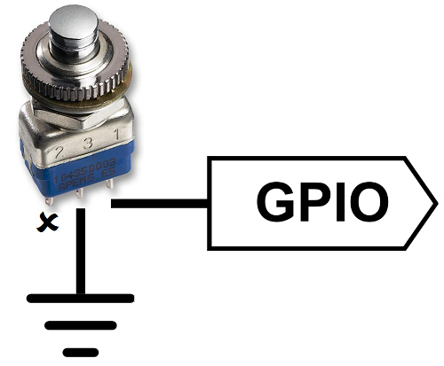

1. GPIO pin
1. Do not connect
1. GND

We recommend that you solder directly onto the button contacts however you could also use crimped wire terminals that friction fit onto the contacts (we felt these were not reliable enough for flight).

The picture below is of one of the flight units that went into space. On the right you can see the base of the RTC board with the connector pins for the buttons. If you look at the button contacts on the left you'll see we used only one black ground wire that went from button to button, it's fine to do this.


## Test the buttons

Once you have all the buttons wired up, boot up your Astro Pi with a monitor, keyboard and mouse connected. We need to download some files and change a few configuration settings. Firstly download the device tree overlay that maps the push buttons to corresponding keyboard keys. Open a terminal and enter these commands:

```bash
cd /boot/overlays
sudo wget https://github.com/raspberrypilearning/3d-printed-astro-pi-flight-case/raw/master/dtb/astropi-keys.dtb
ls
```
Check that the file `astropi-keys.dtb` is now showing in the list of files. Next we need to configure `config.txt` to load this overlay:
```bash
sudo nano /boot/config.txt
```
Go to the bottom of the file and enter the line below:
```bash
dtoverlay=astropi-keys
```
Press `Ctrl - O`, then `Enter` to save followed by `Ctrl - X` to quit.

Now reboot the Astro Pi.
```bash
sudo reboot
```
Now let's download and run a Python test program to check everything is working. The test code uses [Pygame](http://pygame.org/wiki/tutorials) so please do this on the Astro Pis own screen and not via remote access. Open a terminal and enter these commands:
```bash
cd ~
wget https://github.com/raspberrypilearning/3d-printed-astro-pi-flight-case/raw/master/test_code/pygame_test.py
chmod +x pygame_test.py
./pygame_test.py
```
Waggle the joystick and press all the push buttons. If everything is working the joystick should give a direction indication and the buttons will show the corresponding letter.

The flight unit uses hardware pull ups on the GPIO pins, however this test code enables the Raspberry Pis own internal pull up resistors so your button wiring can be nice and simple. Therefore if you didn't use hardware pull ups then you will also need to set the internal pull ups in any Astro Pi code that you write. The block of code below will do this for you, just make sure you have this at the top of each program.
```python
import RPi.GPIO as GPIO

UP = 26
DOWN = 13
LEFT = 20
RIGHT = 19
A = 16
B = 21

GPIO.setmode(GPIO.BCM)

for pin in [UP, DOWN, LEFT, RIGHT, A, B]:
    GPIO.setup(pin, GPIO.IN, GPIO.PUD_UP)
```

## Assemble the case

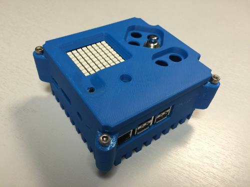
